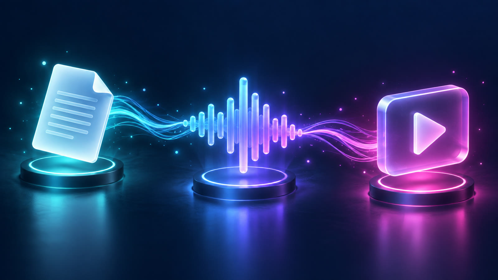
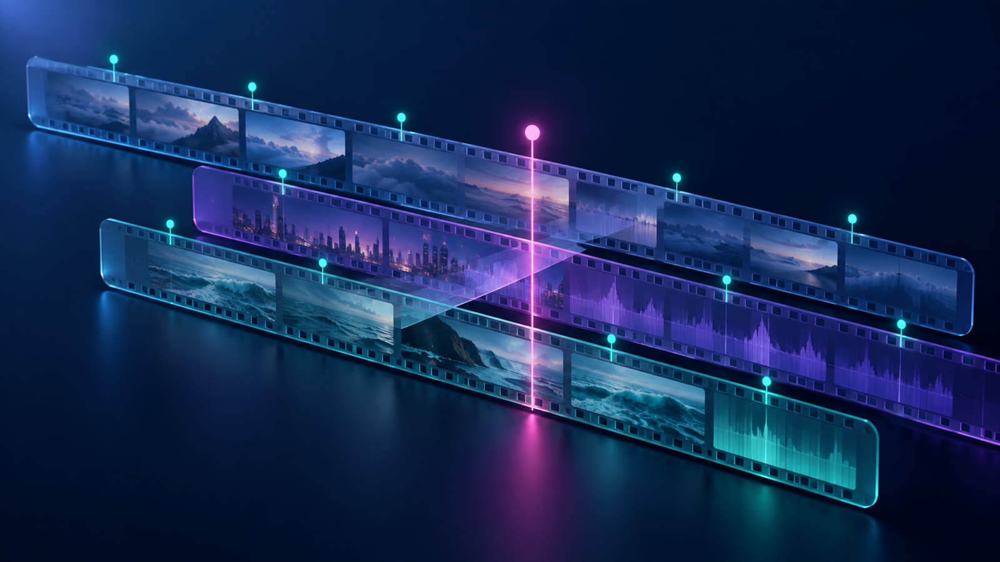

# web-video-produce · 写代码做视频
<p>


</p>
# Language

| Language | README |
| --- | --- |
| 汉语(简体) | 当前位置 |
| 漢語(繁體) | [README_OCN.md](./README_OCN.md) |
| English | [README_EN.md](./README_EN.md) |
| 日本語 | [README_JP.md](./README_JP.md) |


> Feature
> **让纯文本 LLM (LLM) 生成视频（Code-To-Video）**
>  [原理]使用 Web 架构
>  [配音]默认 edge-tts ， 可以调用你自己的 TTS API（example.url/v1）

让AI用代码做视频/剪辑成片：脚本 → 配音 → **写代码** → 逐帧渲染 → MP4。


▶ **示例成片**（11 秒，中文配音 + 字幕 + 自动配乐，全部由本仓库生成）：[`docs/sample-intro.mp4`](docs/sample-intro.mp4)


一个 **DSH Skill**（也是独立可跑的项目）：把「写一段脚本 → 出一条带配音、字幕、背景音乐的 MP4」这件事，变成 LLM 可以自主完成的代码任务
(其实是想做但没时间了，且token也不够了)

它不依赖任何剪辑软件，也不需要多模态模型 —— **纯文本 LLM 就能用**：读文字、写代码、跑命令、看 `ffprobe` 输出、抽帧自检

---

## 目录

- [核心理念](#核心理念)
- [两条能力](#两条能力)
- [快速开始](#快速开始)
- [工作流](#工作流)
- [技术栈](#技术栈)
- [配音：默认 edge-tts，也可以换成你自己的](#配音默认-edge-tts也可以换成你自己的)
- [剪辑模式（EDL 驱动）](#剪辑模式edl-驱动)
- [目录结构](#目录结构)
- [Q & A](#常见问题)
- [许可证](#license)

---

## 核心理念

视频不是"剪"出来的，是**代码算出来的**。因此它天然适合 LLM：

1. **时间轴是唯一真相** —— 视频长度由配音决定。顺序永远是：脚本 → 配音 → 拿到每句的帧号 → 再写画面代码。
2. **每一帧都是纯函数 f(frame)** —— 禁止 `Math.random()`、`Date.now()`、`requestAnimationFrame` 累加时间。渲染必须可复现。
3. **先样片后全片** —— 先渲 1 张静帧确认字体/构图，再渲 3 秒，最后才渲全片。
4. **音频交给专业工具** —— 不写代码合成 TTS，不写代码做混音。edge-tts 出声，FFmpeg 收尾。
5. **交付即验证** —— 出片后用 `ffprobe` 报规格、抽帧看画面，再交给用户。

## 两条能力

| | 输入 | 做什么 | 输出 |
| --- | --- | --- | --- |
| **生成** | 一段文案 / 一个主题 | 分段 → 配音+字幕时间轴 → 写视觉代码 → 逐帧渲染 → 合成 | `output/final.mp4` |
| **剪辑** | 已有素材（自己的/别人给的） | EDL 声明式时间线 → conform 标准化 → 裁剪/转场/水印/画幅/压缩 | `output/edit.mp4` |

两条路线可以混合：Remotion 生成的动画片段，可以像普通素材一样写进剪辑时间线。

## 快速开始

```bash
git clone https://github.com/JinSuperOfficial/web-video-produce.git
cd web-video-produce

# 1) 运行自检程序，环境自检/工程校验/成片规格
python3 scripts/wvp.py doctor

# 2) 依赖
npm install                     # 或其他
npx remotion browser ensure     # 下载 Chrome Headless Shell
python3 -m venv .venv && .venv/bin/pip install edge-tts
# 加载虚拟环境，下载依赖(Edge-TTS)

# 3) 出片：配音 → 时间轴校验 → 静态校验 → 渲染 → 补音轨 → 验收
python3 scripts/wvp.py render --out output/intro10s.mp4
#    先出 2 秒半分辨率样片更省时间：--scale 0.5 --frames 0-60
#    复用已有配音：--no-tts

# 4) 检查时间轴：段/帧/词对不对齐（--verify-audio 会解码音轨实测）
python3 scripts/wvp.py timeline --words
python3 scripts/wvp.py timeline --verify-audio

# 5) 剪辑路线：先看命令，再动手
python3 scripts/vedit.py transitions                        # 不知道用哪种转场时
python3 scripts/vedit.py plan  --edl examples/edit-plan.example.json
python3 scripts/vedit.py build --edl examples/edit-plan.example.json
```

`wvp.py` 是本项目的统一入口，只有三个子命令（`doctor` / `render` / `timeline`

**环境要求**：
1. Node ≥ 18
2. Python ≥ 3.9
3. FFmpeg ≥ 6（需要 `libx264` / `aac` / `libass`）
4. Windows / macOS / Linux 均可

## 工作流



```
文本 → 分段脚本(JSON) → edge-tts 配音 + 字幕 + 帧号时间轴 + 逐词时间戳
                              ↓
            Remotion / React / Three.js / Canvas 写画面
         （motion 动作库 + transitions 转场层 + SFX 音效轨）
                              ↓
                  帧渲染 → FFmpeg 合成 → MP4
```

配音这一步会产出四样东西，它们是一切的锚点：

| 产物 | 用途 |
| --- | --- |
| `vo.mp3` | 整条配音轨（含段间停顿与背景配乐） |
| `vo.srt` / `vo.vtt` | 与音轨严格对齐的字幕（按标点断句，紧贴真实语音） |
| `manifest.json` | **每句台词的起止帧号** —— 画面代码只认它，不认"大概几秒" |
| `words.json` | **逐词时间戳** —— 卡拉OK 高亮、音效卡点、逐词校对 |

## 技术栈


| 层 | 技术 | 用在哪 |
| --- | --- | --- |
| 结构 | HTML / CSS / JavaScript | 网页即画布 |
| 2D 图形 | Canvas 2D | 图表、粒子、波形、数据可视化 |
| 3D | Three.js（`@remotion/three`） | 产品演示、空间感、模型动画 |
| 渲染增强 | WebGL / GLSL Shader | 流体、光效、纹理、后处理 |
| 组件化与合成 | React + TypeScript + **Remotion** | 多镜头、字幕、音画同步（主推） |
| 时间线动画 | GSAP | 复杂缓动与时间线编排 |
| 配音 | **edge-tts**（默认）/ 自建 TTS API | 语音合成 |
| 编码合成 | FFmpeg | 混流、混音、烧字幕、转场、剪辑 |

## 配音：默认 edge-tts，也可以换成你自己的


### 默认：edge-tts（免费，开箱可用）

```bash
# 列出全部中文音色
.venv/bin/python scripts/tts_edge.py --list-voices zh

# 选音色：同一句话，多音色对照试听，不盲选
.venv/bin/python scripts/tts_audition.py --outdir output/voice_samples --rate +5%

# 正式生成（默认整段韵律模式 + 自动加背景配乐 + 段间停顿）
.venv/bin/python scripts/tts_edge.py \
  --script examples/script.intro10s.json \
  --outdir public/voice \
  --voice zh-CN-XiaoxiaoNeural --rate +5% --fps 30 --normalize
```

内置 14 个中文音色（`zh-CN-*` / `zh-HK-*` / `zh-TW-*`），常用几个：

| 音色 | 听感 | 场景 |
| --- | --- | --- |
| `zh-CN-XiaoxiaoNeural` | 女·温暖通用 | 口播、叙事（默认） |
| `zh-CN-YunxiNeural` | 男·阳光少年感 | 科技、Vlog |
| `zh-CN-YunjianNeural` | 男·浑厚有力 | 宣传片、预告 |
| `zh-CN-YunyangNeural` | 男·专业播报 | 新闻、纪录片 |
| `zh-CN-XiaoyiNeural` | 女·活泼明亮 | 短视频、教程 |

### 三条硬约束（踩过的坑，写进代码里了）

| 约束 | 原因 | 实测 |
| --- | --- | --- |
| **稿子不写句号「。」** | 句号触发"句末下降调 + 长停顿"，一句一个降调 = 机器念课文。工具会**自动剔除**并在日志里告诉你剔了几个 | — |
| **整段韵律模式**（默认） | 分段合成时**每次请求自带约 0.6s 尾静音**，语调还在段首重置，听感一顿一顿 | 同稿：分段 8.75s → 整段 6.98s，差的 1.8 秒**全是假停顿** |
| **语速 +0% ~ +5%** | 超过 +10% 明显发飘、齿音重 | — |

停顿与配乐默认就开：**段间 400ms 真停顿**（不是无缝衔接）、**片尾 600ms 呼吸**、**BGM 侧链闪避**（一说话音乐自动压低）。

> 背景音乐是 `scripts/make_bgm.py` 用代码合成的（正弦加法合成 + 和弦交叉淡化），**免版权、可商用、可无缝循环**。想换就丢一个 mp3 到 `assets/bgm.mp3`。
>
> 混音用**多频段 carve** 而不是整体压低：先 Linkwitz-Riley 分频（300Hz / 3400Hz），只对人声频段做侧链压限。
> 实测同一条片子低频能量——不处理 −35.4dB / 整体闪避 −43.2dB（音乐瘪掉）/ carve −36.1dB（**音乐保住了**）。
> 响度用两遍 `loudnorm`（线性增益），`--loudness-target social|podcast|broadcast` = −14 / −16 / −23 LUFS。

### 换成你自己的 TTS API

只要你的服务能"给文本、还音频"，就能接进来 —— 语音合成的时间和字幕逻辑完全复用。

**A. OpenAI 兼容的 `/audio/speech`**（OpenAI、SiliconFlow、智谱、火山方舟等多数厂商都行这个形状）
(本地的没试过，但概率也行......)
```bash
export TTS_API_KEY=sk-xxxx        # 或 --tts-api-key

.venv/bin/python scripts/tts_edge.py --script examples/script.intro10s.json \
  --outdir public/voice \
  --engine openai \
  --tts-base-url https://api.openai.com/v1 \
  --tts-model gpt-4o-mini-tts \
  --voice alloy \
  --bgm assets/bgm.mp3
```

**B. VoiceCraft 系接口**（`POST /v1/audio/speech`，字段 `input` / `voice` / `speed` / `pitch` / `style` / `volume`）

这个来自开源项目 [JinSuperOfficial/tts-voice-magic](https://github.com/JinSuperOfficial/tts-voice-magic)
原tts项目作者见该tts仓库上游（VoiceCraft，基于微软 Edge TTS，可一键部署到 Cloudflare Workers）。它比 A 多一个 `style`
情感/角色参数（`general` / `newscast` / `cheerful` / `serious` / `gentle` …）。

```bash
# 自己部署一份（推荐）：https://github.com/JinSuperOfficial/tts-voice-magic
# 或直接用已经部署好的实例（本机实测可用）
.venv/bin/python scripts/tts_edge.py --script examples/script.intro10s.json \
  --outdir public/voice --fps 30 \
  --engine voicecraft \
  --tts-base-url https://tts.jinsuper.cn/v1 \
  --voice zh-CN-XiaoxiaoNeural \
  --rate +5% --tts-style newscast
```
> [!WARNING]
> 一个实测踩到的坑：Cloudflare 前置的站点会拦掉 Python 默认的 User-Agent
> （`Python-urllib/3.x` → `HTTP 403 error code: 1010`），而 `curl` 是通的。
> 脚本已默认带正常 UA，所以开箱可用；换别的 HTTP 客户端时要自己设 UA。

**C. 完全自定义端点**（各家字段不一样时，用 JSON 模板适配）

```bash
.venv/bin/python scripts/tts_edge.py --script script.json --outdir public/voice \
  --engine custom \
  --tts-endpoint https://your-tts.example.com/v1/synthesize \
  --tts-header "X-App-Id=my-app" \
  --tts-payload '{"text":"{text}","speaker":"{voice}","format":"mp3"}' \
  --voice my-speaker-id
```

模板里可用 `{text}` `{voice}` `{model}` `{speed}` 占位符；响应体直接是音频字节即可。

> 自建引擎拿不到逐词边界，因此会自动改用分段模式（每段一次请求）—— 时间轴由 `ffprobe` 回读，依然精确；
> 字幕按"一句一段"生成，`words.json` 如实标注 `precision: "none"`，不假装有逐词精度。

## 剪辑模式（EDL 驱动）[Experimental]



用一份 JSON 描述时间线，工具生成 FFmpeg 命令并执行。**三阶段流水线**，绝不把异构素材直接喂进滤镜图：

```
素材(异构) ──conform──▶ 统一规格 ──assemble──▶ 时间线 ──finish──▶ output/edit.mp4
  分辨率/帧率/音轨不一     裁剪+xfade+acrossfade      叠加/混音/字幕/压缩
```

```bash
# 先看命令，再动手（剪辑不可逆，别盲跑）
python3 scripts/vedit.py plan  --edl examples/edit-plan.example.json
python3 scripts/vedit.py build --edl examples/edit-plan.example.json

# 横屏 → 竖屏（模糊垫底，短视频常用）
python3 scripts/vedit.py build --edl examples/edit-plan.example.json --aspect vertical
```

能力：裁剪 / 多段拼接 / **xfade 转场**（58 种，与音频 acrossfade 成对）/ 水印与画中画 / 三种画幅适配（pad·crop·blur）/ 目标体积压缩 / 与 Remotion 生成的片段混合成片。

四条硬约束：

1. **先 conform 再拼** —— 分辨率/帧率/编码/采样率/音轨数统一，无音轨自动补静音；
2. **offset = 前段累计时长 − 转场时长**，且 `转场时长 ≤ min(前段,后段)/2`，越界直接报错；
3. **音视频成对处理** —— 有 xfade 必有同值 acrossfade，杜绝爆音断音；
4. **四级降级兜底** —— `xfade → concat filter → concat demuxer(copy) → 报错保留现场`，降级了会明确告诉你。

## 目录结构

```
web-video-produce/
├─ SKILL.md                 # ★ Agent 技能主文档（LLM 读这个就够了）
├─ project.md               # ★ 项目交接文档（架构 / 决策 / 扩展点）
├─ scripts/
│   ├─ tts_edge.py          # 配音 + 字幕 + 帧号时间轴（edge-tts / 自建 API / BGM / 停顿）
│   ├─ tts_audition.py      # 同句多音色对照试听
│   ├─ make_bgm.py          # 代码合成免版权 BGM
│   ├─ validate.py          # 静态校验器（渲染前后各跑一次）
│   ├─ vedit.py             # EDL 剪辑器（probe / plan / build / conform）
│   ├─ mux.sh               # 混流 / 混音 / 烧字幕 / 响度归一
│   ├─ capture_frames.mjs   # HTML 页面确定性逐帧截图（Playwright）
│   ├─ frames_to_video.sh   # PNG 序列 → MP4
│   ├─ make_sample_assets.sh# 生成异构 demo 素材
│   └─ check_env.sh         # 环境自检
├─ src/                     # Remotion 工程（Root / Main / 字幕 / 三套场景）
├─ templates/html-gsap/     # 帧协议 + Canvas2D + GSAP 模板
├─ examples/                # 分段脚本 + EDL 示例
├─ assets/                  # 素材（bgm / logo / raw）
├─ public/voice/            # 生成的配音与时间轴（gitignore）
└─ output/                  # 交付目录
```

## 渲染前先自检

```bash
python3 scripts/validate.py                      # 源码 + 时间轴：1 秒内出结果
python3 scripts/validate.py --out output/final.mp4   # 再加上成片规格、色彩空间、响度
python3 scripts/validate.py --json               # Agent 友好
```

它检查：确定性铁律（`Math.random`/`Date.now`/自走动画）、`manifest.json ↔ config.ts` 的 fps 与时长一致性、
场景 id 是否都在配音脚本里、`staticFile` 与 EDL 引用的素材是否存在、中文字体是否加载、
成片的像素格式 / **色彩空间 bt709** / 色彩范围 tv / 峰值 / 平均音量 / 整体 LUFS。

> 这个校验器抓到过一个真问题：Remotion 默认不传色彩参数，成片会写成 full-range `yuvj420p` + BT.601，
> 上传到平台转码时颜色会漂。现在 `remotion.config.ts` 固定 `Config.setColorSpace('bt709')`。

## 常见问题

<details>
<summary><b>中文渲染成豆腐块 □□□</b></summary>

headless 环境常常一个 CJK 字体都没有。`SKILL.md` §4.5 给了三种解法，推荐把 woff2 放进 `public/fonts/` 用 `@remotion/fonts` 加载（一个文件、一次请求、完全离线）。
</details>

<details>
<summary><b>渲染很慢</b></summary>

默认用 `@remotion/google-fonts` 会在首次渲染预加载全部字体子集（约 294 个请求，1-2 分钟）。换成自带字体文件即可大幅提速。另外先 `--scale=0.5` 出样片，确认没问题再渲全片。
</details>

<details>
<summary><b>配音听起来很假</b></summary>

见上文的[三条硬约束](#三条硬约束踩过的坑写进代码里了)。工具已经默认帮你做了：去句号、整段韵律、降速、加停顿、配 BGM。仍不满意就换引擎（Azure SSML / MiniMax / 火山 / 本地 GPT-SoVITS 克隆）。
</details>

<details>
<summary><b>拼接后花屏 / 转场处黑帧 / 声音爆掉</b></summary>

素材参数不一致。`vedit.py` 会强制先 conform；手工拼时务必统一分辨率、帧率、像素格式、采样率，并且**有 xfade 就要有 acrossfade**。
</details>

## License

[MIT](LICENSE) © JinSuperOfficial

内置 BGM 由 `scripts/make_bgm.py` 代码合成，无第三方素材，可商用。edge-tts 调用的是微软 Edge「大声朗读」的公开端点，**不是官方商用 API**，可能限流或变更；商用关键场景请换成有 SLA 的服务。
